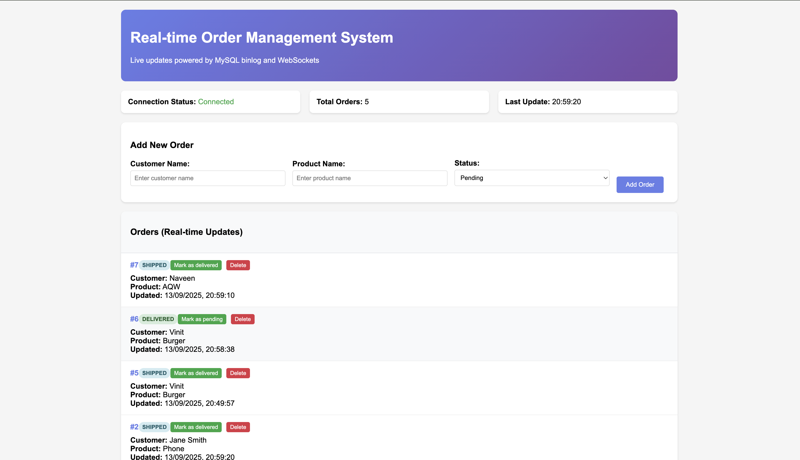

---

# Real-time Database Change Notification System

A production-ready real-time system that notifies clients when data changes in a MySQL database using **triggers**, a **change log table**, and **WebSockets**.

---

##  Architecture Overview

**Flow:**

```
Database Change → Trigger → Change Log Table → Change Listener → WebSocket Broadcast → Clients
```

**Components:**

* **MySQL Database** (with triggers + change log table)
* **Node.js Backend** (Express + WebSocket)
* **Change Listener** (efficient polling every 500ms)
* **Web Client** (real-time dashboard)

---

##  Features

* Real-time notifications for `INSERT`, `UPDATE`, `DELETE`
* WebSocket push (no client polling)
* Sub-500ms latency
* REST API for CRUD operations
* Automatic reconnection & error handling
* Health check & monitoring endpoints
* Responsive web interface with live updates

---

## Installation

### 1. Setup Project

```bash
mkdir real-time-db-updates
cd real-time-db-updates
npm init -y
npm install express mysql2 ws dotenv cors
npm install --save-dev nodemon
```

### 2. Environment Configuration

Create a `.env` file:

```env
DB_HOST=localhost
DB_PORT=3306
DB_USER=root
DB_PASSWORD=your_password
DB_NAME=realtime_orders
PORT=3000
WS_PORT=8080
```

### 3. Start Application

```bash
npm start
```

---

##  Access

* **Web Interface:** [http://localhost:3000](http://localhost:3000)
* **WebSocket:** ws\://localhost:8080
* **API:** [http://localhost:3000/api/orders](http://localhost:3000/api/orders)
* **Health:** [http://localhost:3000/health](http://localhost:3000/health)

---

##  Project Structure

```
real-time-db-updates/
├── server.js          # Express + WebSocket server
├── database.js        # MySQL connection
├── changeListener.js  # Polling + broadcasting
├── client.html        # Web dashboard
├── .env
└── README.md
```

---

##  Example API Usage

```bash
# Create order
curl -X POST http://localhost:3000/api/orders \
  -H "Content-Type: application/json" \
  -d '{"customer_name":"Alice","product_name":"Keyboard","status":"pending"}'

# Update order
curl -X PUT http://localhost:3000/api/orders/1 \
  -H "Content-Type: application/json" \
  -d '{"status":"shipped"}'
```

---

##  Screenshots

### Web Interface

```md

```

### Real-time Updates

```md

```

---

##  Points

* **Triggers vs. Binlog:** chose triggers for portability and simplicity
* **WebSockets vs. SSE:** WebSockets enable bidirectional communication
* **Polling Listener:** lightweight, reliable, avoids binlog parsing complexity
* **Scalability:** index change log, use Redis for WebSocket scaling

---

## 📄 License

MIT License

---
